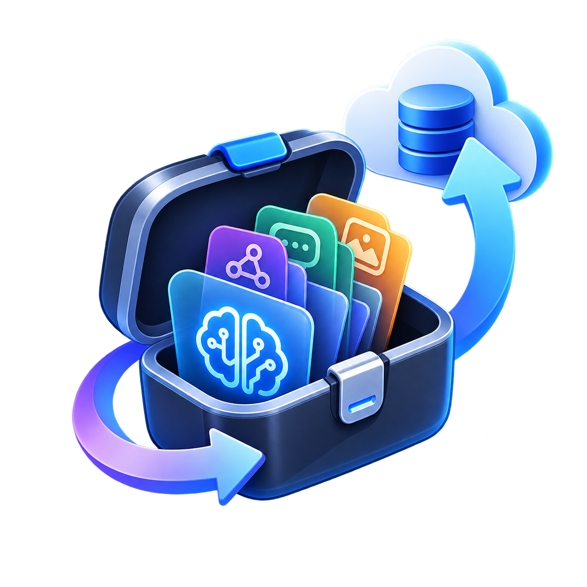

# AgentBox

<p align="center">
  
</p>

**Your AI coding setup should not be trapped in one tool or on one machine.**

AgentBox backs up the skills, commands, prompts, and supporting files used by Claude Code, Codex, and OpenCode without rewriting them. Restore exact originals, move compatible resources between providers, and stop conflicts before they touch a target.

Keep the catalog in a local folder, a Git repository, or both. Every browser write starts with a reviewed dry run. No hosted service, account, analytics, or telemetry.

## AI Development Disclosure

AgentBox is built with substantial assistance from GPT 5.5, GPT 5.6, and Claude Fable. Humans decide the behavior and own the testing, debugging, and review.

That is not hidden or softened: if you do not want AI-assisted software, do not use AgentBox.

AI output is not treated as proof. Verification includes isolated filesystem tests, local bare Git repositories, browser security tests, package builds, dry-run invariants, and explicit human review of failures.

## Supported Providers

**AgentBox only writes provider formats it understands.**

Backup and restore are supported for:

| Provider | Managed resources |
| --- | --- |
| Claude Code | Skills and commands |
| Codex | Skills and prompts |
| OpenCode | Skills and commands |

Cursor, Windsurf, Gemini CLI, GitHub Copilot, Continue, Goose, and Kiro are detected for visibility only. AgentBox shows their status but does not copy their files. Detection is not backup support.

## Safety Before Convenience

Configuration is treated as valuable data, so uncertainty blocks the operation instead of becoming a destructive shortcut.

- **Preflight the whole operation.** Multi-provider changes pass every check before the first write. Browser changes also require a reviewed dry run.
- **Keep a way back.** Existing restore targets receive timestamped safety copies before replacement.
- **Retain local revisions.** Changed backups in local-only storage create immutable, content-addressed catalog revisions that can be reviewed before restore.
- **Reject unsafe paths.** Symlinked sources, catalogs, traversal, and overlapping destinations are blocked. Replacing a symlinked restore target requires an explicit `--force`.
- **Never prune blindly.** An unavailable source cannot silently remove its only known backup.
- **Keep Git recoverable.** Pushes are never forced. Rejected pushes roll back managed changes, while ambiguous outcomes preserve recoverable state for the next run.
- **Refuse split-brain storage.** Dual storage stops when its local and Git copies disagree or Git is unavailable.
- **Keep the UI local.** The web server binds only to loopback and serves every asset locally.

## Install

### Homebrew

The Homebrew formula supports Apple Silicon macOS and x86-64 or ARM64 Linux. Because the tap lives in the application repository, add its explicit URL once:

```bash
brew tap simaxlabs/agentbox https://github.com/SimaxLabs/agentbox.git
brew install simaxlabs/agentbox/agentbox
```

Homebrew owns subsequent replacement:

```bash
brew upgrade agentbox
```

### Scoop

The Scoop bucket installs the 64-bit Windows release:

```powershell
scoop bucket add agentbox https://github.com/SimaxLabs/agentbox.git
scoop install agentbox/agentbox
scoop update agentbox
```

### From Source

Source installation requires Python 3.14 or newer.

```bash
python3 -m venv .venv
source .venv/bin/activate
pip install -e .
```

Windows PowerShell:

```powershell
py -m venv .venv
.venv\Scripts\Activate.ps1
python -m pip install -e .
```

Installed commands:

```text
agentbox
agentbox-ui
```

The executable source launcher is `./agentbox.py`.

## Updates

**AgentBox tells you when a new version exists. It never installs one for you.**

After a successful CLI operation, AgentBox checks the latest release and caches the result for six hours. The CLI prints a notice and the browser UI shows a banner when an update is available.

- Homebrew: run `brew upgrade agentbox`.
- Scoop: run `scoop update agentbox`.
- Standalone executable: follow the release link and download it again.
- Source or Python package: repeat the installation method you originally used.

Update checks contact `api.github.com` for `SimaxLabs/agentbox`; they do not send catalog contents or configuration data. Set `AGENTBOX_NO_UPDATE_CHECK=1` to disable automatic checks.

## First Run

**First run is a reviewed setup, not a silent configuration step.**

```bash
agentbox ui
```

When no configuration is discovered, AgentBox opens onboarding and:

1. Detects supported and recognized providers.
2. Lets you choose managed resources.
3. Lets you choose local, Git, or dual storage.
4. Shows a dry-run of the configuration change.
5. Saves only after explicit confirmation.

Running from this repository uses its included `agentbox.json` and skips onboarding. Run the installed command from another directory to see the first-run flow.

The browser UI is available at `http://127.0.0.1:8765` by default.

```bash
agentbox ui --port 9000
```

## Core Workflow

Preview and create a backup:

```bash
agentbox backup all --dry-run
agentbox backup all
```

Check drift:

```bash
agentbox status
agentbox status codex
```

Restore matching portable resources:

```bash
agentbox restore claude --dry-run
agentbox restore claude
```

Restore from another provider:

```bash
agentbox restore claude --from opencode
```

Restore exact originals to recorded locations:

```bash
agentbox restore opencode --as-backed-up
```

Restore across all catalog hosts:

```bash
agentbox restore opencode --all-hosts
```

## Catalog History

Local-only storage keeps a revision after every successful backup that changes the catalog. Dry runs, failed backups, and unchanged backups do not create revisions. Repeated file content is stored once.

List revisions or inspect one:

```bash
agentbox history
agentbox history 20260821T102909799895Z-5f8a026d4a10051c
```

Preview and restore from an older revision:

```bash
agentbox restore opencode --revision REVISION_ID --dry-run
agentbox restore opencode --revision REVISION_ID
```

Add `--as-backed-up`, `--from`, `--all-tools`, or `--all-hosts` as with a current-catalog restore. The older revision is a read-only source: restoring it changes provider files but does not rewind the current catalog. The browser UI exposes the same revision list, inspection, preview, and confirmation flow.

Native history is intentionally limited to local-only storage. Git and dual storage use Git commits for version history. Local revision data is kept separately under the platform AgentBox data directory in `history/<catalog-path-hash>`.

Retention is unlimited unless `history.max_revisions` is set in the configuration:

```json
{
  "history": {
    "max_revisions": 20
  }
}
```

After a new revision is safely published, older revisions beyond the limit and any now-unreferenced content are removed.

## Storage

Configure a local catalog:

```bash
agentbox storage --local ~/Backups/agentbox-catalog
```

Configure managed Git storage:

```bash
agentbox storage --git git@github.com:example/private-agentbox-catalog.git
```

Keep both copies:

```bash
agentbox storage \
  --local ~/Backups/agentbox-catalog \
  --git git@github.com:example/private-agentbox-catalog.git
```

Add `--dry-run` to preview a storage configuration change.

Default local catalog locations:

- Windows: `%LOCALAPPDATA%\AgentBox\catalog`
- Linux: `${XDG_DATA_HOME:-~/.local/share}/agentbox/catalog`
- macOS: `${XDG_DATA_HOME:-~/.local/share}/agentbox/catalog`

Managed Git checkouts live under the corresponding platform data directory in `AgentBox/repositories` or `agentbox/repositories`.

## Configuration

Configuration lookup order:

1. `AGENTBOX_CONFIG`
2. The repository launcher’s adjacent `agentbox.json`
3. `agentbox.json` in the current directory
4. The platform user configuration

Platform user configuration locations:

- Windows: `%APPDATA%\AgentBox\config.json`
- Linux and macOS: `${XDG_CONFIG_HOME:-~/.config}/agentbox/config.json`

Override the host namespace with `AGENTBOX_HOST` or the global `--host` option.

```bash
AGENTBOX_HOST=workstation agentbox backup all
agentbox --host workstation backup all
```

Global options must precede the action:

```bash
agentbox --config /path/to/agentbox.json backup all
```

## License

AgentBox is licensed under the GNU General Public License v3.0 only (`GPL-3.0-only`). See `LICENSE`.
